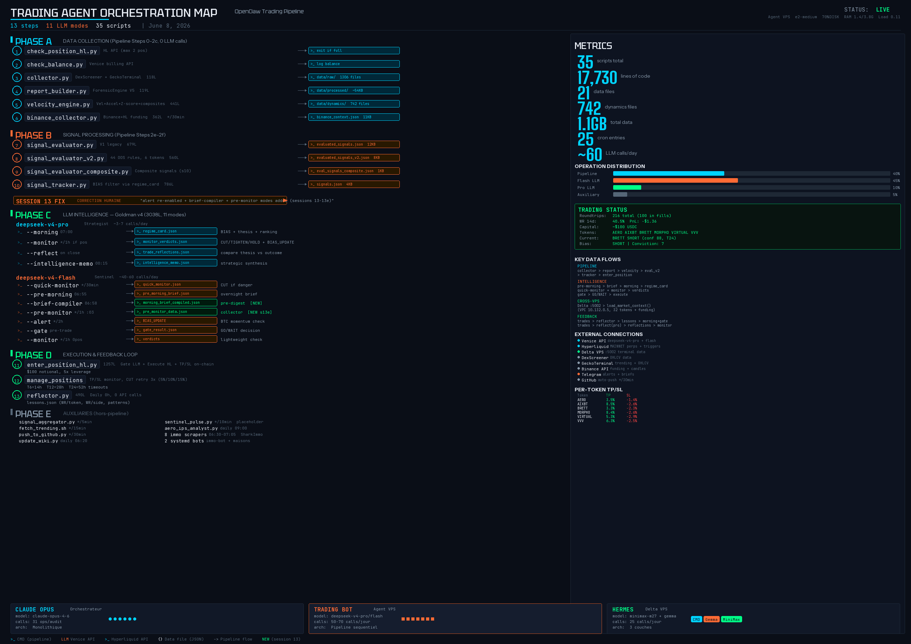
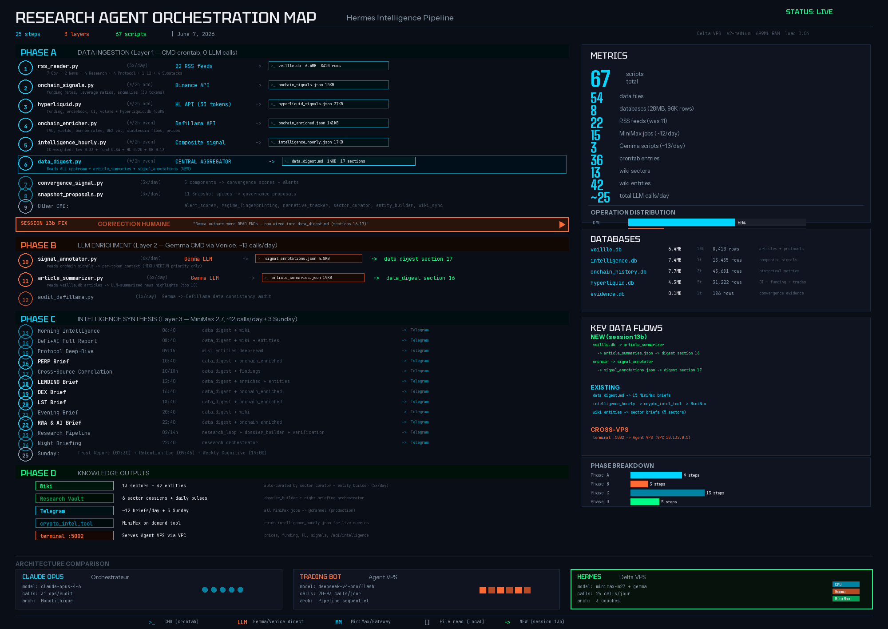

# 0xDVTA — Autonomous Trading & Intelligence Infrastructure

<p align="center">
  
  
  
  
  
  
</p>

> **0xDVTA** is a fully autonomous crypto trading infrastructure running 24/7 on two GCP VPS instances. It combines a quantitative trading pipeline on Hyperliquid with a 3-layer intelligence system (Hermes) that feeds market context, forensic analysis, and LLM-driven strategic reasoning into every trade decision.

> Originally forked from [0xDELTA](https://github.com/JohnPreston2/0xdelta-hub) (Solana forensic agent for the Bags Hackathon 2026), the project has evolved into a complete trading infrastructure with institutional-grade signal evaluation, per-token risk management, and a multi-model intelligence flywheel.

---

## Architecture Overview

The system runs across **two VPS instances** connected via GCP VPC internal network:

```
┌─────────────────────────────────────┐     VPC 10.132.0.5:5002      ┌──────────────────────────────────────┐
│         AGENT VPS (Execution)       │◄─────────────────────────────│        DELTA VPS (Intelligence)       │
│         openclaw-agent              │                               │        openclawdelta                  │
│         e2-medium, 3.8GB RAM        │                               │        e2-medium, 3.8GB RAM           │
│                                     │                               │                                      │
│  ┌─────────────────────────────┐    │                               │  ┌──────────────────────────────┐    │
│  │  Trading Pipeline (*/2h)    │    │                               │  │  Hermes Intelligence Agent   │    │
│  │  13 steps, 35 scripts       │    │                               │  │  67 scripts, 3 layers        │    │
│  │  17,730 lines of code       │    │                               │  │  8 databases, 25 LLM calls/d │    │
│  └─────────────────────────────┘    │                               │  └──────────────────────────────┘    │
│                                     │                               │                                      │
│  ┌─────────────────────────────┐    │                               │  ┌──────────────────────────────┐    │
│  │  Goldman v4 (LLM Layer)     │    │                               │  │  crypto-terminal :5002       │    │
│  │  3038L, 11 modes            │    │     ┌─────────┐               │  │  32 tokens, funding, HL,     │    │
│  │  pro: 3-7 calls/day         │◄───│─────│ Venice  │──────────────►│  │  signals, news, intelligence │    │
│  │  flash: 40-60 calls/day     │    │     │   API   │               │  └──────────────────────────────┘    │
│  └─────────────────────────────┘    │     └─────────┘               │                                      │
│                                     │                               │  ┌──────────────────────────────┐    │
│  ┌─────────────────────────────┐    │                               │  │  Wiki Karpathy               │    │
│  │  Hyperliquid MAINNET        │    │                               │  │  13 sectors, 42 entities     │    │
│  │  6 tokens, $100/trade, 5x   │    │                               │  └──────────────────────────────┘    │
│  └─────────────────────────────┘    │                               │                                      │
└─────────────────────────────────────┘                               └──────────────────────────────────────┘
```

### Orchestration Maps

<details>
<summary><b>Agent VPS — Trading Pipeline (click to expand)</b></summary>



</details>

<details>
<summary><b>Delta VPS — Hermes Intelligence Pipeline (click to expand)</b></summary>



</details>

---

## Phase A — Data Collection (0 LLM calls)

The pipeline runs every 2 hours via `run_pipeline.sh` and begins with pure data collection:

| Step | Script | Source | Output |
|------|--------|--------|--------|
| 0 | `check_position_hl.py` | Hyperliquid API | Exit if 2 positions open |
| 0b | `check_balance.py` | Venice billing API | Log balance |
| 1 | `collector.py` | DexScreener + GeckoTerminal | `data/raw/` (1,306 files) |
| 2 | `report_builder.py` | ForensicEngine V5 | `data/processed/` (~54KB/cycle) |
| 2c | `velocity_engine.py` | Rolling computations | `data/dynamics/` (742 files) |
| bg | `binance_collector.py` | Binance + HL APIs (*/30min) | `binance_context.json` |

### Forensic Engine V5 — 30+ Metrics

The forensic engine computes metrics across 6 analytical dimensions every pipeline cycle:

- **Liquidity** — ICR (crash risk), LCR (concentration), IPS (impact sensitivity)
- **Flows** — NBP (net buy pressure), EV (expected value), VWAD
- **Concentration** — WCC (whale change), TCI (top concentration), FCI (cluster index)
- **Bull Flag** — BPI (bull power), FQS (flag quality), Fibonacci targets
- **Technical** — RSI (1h/15m), SI (sentiment), BER (bull/bear energy)
- **Convergence** — FHS (forensic health 0-10), phase classification

The **velocity engine** then adds a dynamic layer: velocity, acceleration, z-scores, and 5 composite indicators (LMI, SDA, NBR, SMP, RSI_ICR) computed on rolling windows.

---

## Phase B — Signal Processing

| Step | Script | Lines | Description | Output |
|------|--------|-------|-------------|--------|
| 2e | `signal_evaluator.py` | 679 | V1 legacy rules | `evaluated_signals.json` |
| 2e-bis | `signal_evaluator_v2.py` | 560 | **44 OOS-validated rules** | `evaluated_signals_v2.json` |
| 2e-ter | `signal_evaluator_composite.py` | — | Composite signals (session 10) | `evaluated_signals_composite.json` |
| 2f | `signal_tracker.py` | 786 | BIAS filter via `regime_card.json` | `signals.json` |

### Signal Evaluator V2 — The Edge

44 institutional-grade rules surviving rigorous out-of-sample validation:
- **Statistical validation**: Fisher exact test + Benjamini-Hochberg FDR correction
- **OOS requirement**: WR >= 50% on both training and test periods
- **Coverage**: 6 tokens (AERO, AIXBT, BRETT, MORPHO, VIRTUAL, VVV)
- **Average R:R**: ~2.5 across all rules

The signal tracker applies the BIAS filter (LONG/SHORT/NEUTRAL from the morning LLM briefing) to block signals that contradict the current market regime.

---

## Phase C — LLM Intelligence (Goldman v4)

`financial_agent.py` (3,038 lines) implements 11 operational modes using a **two-model architecture**: a pro strategist for high-stakes decisions, and a flash sentinel for continuous monitoring.

### Pro Model (deepseek-v4-pro) — ~3-7 calls/day

| Mode | Schedule | Output | Role |
|------|----------|--------|------|
| `--morning` | 07:00 UTC | `regime_card.json` | BIAS + thesis + token ranking + conviction |
| `--monitor` | */1h (if positions) | `monitor_verdicts.json` | CUT/TIGHTEN/HOLD + BIAS_UPDATE |
| `--reflect` | on position close | `trade_reflections.json` | Compare thesis vs outcome |
| `--intelligence-memo` | 00:15 UTC | `intelligence_memo.json` | Daily strategic synthesis |

### Flash Model (deepseek-v4-flash) — ~40-60 calls/day

| Mode | Schedule | Output | Role |
|------|----------|--------|------|
| `--quick-monitor` | */30min | `quick_monitor.json` | CUT if danger detected |
| `--pre-morning` | 06:55 UTC | `pre_morning_brief.json` | Overnight brief for pro |
| `--brief-compiler` | 06:58 UTC | `morning_brief_compiled.json` | Pre-digest for morning |
| `--pre-monitor` | */1h :03 | `pre_monitor_data.json` | Data collector for monitor |
| `--alert` | */2h | BIAS_UPDATE | BTC momentum check |
| `--gate` | pre-trade | `gate_result.json` | GO/WAIT trade decision |
| `--monitor` | */1h (if 0 pos) | verdicts | Lightweight market check |

### Intelligence Flywheel

```
trades ──► reflector (0 API) ──► lessons.json (WR/token, WR/side, patterns)
                                      │
trades ──► reflect (pro) ──► trade_reflections.json
                                      │
                                      ▼
intelligence-memo (pro, daily) ──► intelligence_memo.json
                                      │
                                      ▼
pre-morning (flash) ──► brief-compiler (flash) ──► morning (pro) ──► regime_card.json
                                                                          │
                                                                          ▼
                                                               Better trade decisions
```

---

## Phase D — Execution

| Component | Description |
|-----------|-------------|
| `enter_position_hl.py` (1,257L) | Gate LLM → Execute on Hyperliquid → TP/SL trigger orders on-chain |
| `manage_positions` | TP/SL monitoring, timeout management, CUT retry (3 attempts: 5%/10%/15% slippage) |
| `reflector.py` (490L) | Daily trade analysis at midnight, 0 API calls |

### Trading Parameters

| Parameter | Value |
|-----------|-------|
| Capital | ~$100 USDC |
| Notional per trade | $100 (5x leverage = ~$20 margin) |
| Max positions | 2 simultaneous |
| Min confidence | >= 55 |

### Per-Token TP/SL (Backtest-Optimized)

| Token | TP | SL | Timeout |
|-------|----|----|---------|
| AERO | +3.5% | -1.4% | T6: 14h |
| AIXBT | +8.5% | -2.6% | T12: 28h |
| BRETT | +3.3% | -2.3% | T24: 52h |
| MORPHO | +8.4% | -2.6% | — |
| VIRTUAL | +5.3% | -2.9% | — |
| VVV | +6.3% | -2.5% | — |

---

## Delta VPS — Hermes Intelligence

The second VPS runs the **Hermes** intelligence agent — a 3-layer data pipeline that feeds the trading bot with market context:

### Layer 1: CMD (0 LLM, crontab)
12 scripts collecting raw data: RSS feeds (22 sources), on-chain signals (Binance API, 33 tokens), Hyperliquid data (OI, funding, orderbook), DeFiLlama enrichment, composite signal computation, and data aggregation across 17 sections.

### Layer 2: Gemma CMD (~13 LLM calls/day)
3 Venice-direct scripts: `signal_annotator.py` (6x/day), `article_summarizer.py` (6x/day), `audit_defillama.py` (1x/day).

### Layer 3: MiniMax 2.7 (~12 calls/day + 3 Sunday)
15 Hermes gateway jobs producing Telegram briefs: morning intelligence, DeFi+AI report, protocol deep-dive, 5 sector briefs (PERP, LENDING, DEX, LST, RWA+AI), evening brief, research pipeline, and Sunday trust report + retention log + weekly cognitive.

### Databases (Delta)

| Database | Size | Rows | Content |
|----------|------|------|---------|
| veille.db | 6.4MB | 8,410 | articles + protocols |
| intelligence.db | 7.4MB | 13,435 | composite signals |
| onchain_history.db | 7.7MB | 43,681 | historical metrics |
| hyperliquid.db | 4.3MB | 31,222 | OI + funding + trades |
| evidence.db | 0.1MB | 186 | convergence evidence |

### Terminal API (:5002)
Serves live market data to the Agent VPS via GCP VPC internal network:
- `/api/prices` — 32 tokens, 6 categories
- `/api/funding` — 30 tokens Binance Futures
- `/api/hyperliquid` — 33 tokens (OI, funding, orderbook)
- `/api/signals` — anomalies from Hermes
- `/api/news/all` — RSS + CryptoPanic
- `/api/intelligence` — composite scores + tier (A/B/C) per token

---

## External Connections

| Service | Role | Protocol |
|---------|------|----------|
| **Venice API** | LLM inference (DeepSeek v4 pro + flash) | HTTPS |
| **Hyperliquid** | MAINNET perps execution + trigger orders | SDK |
| **Delta VPS** | Market intelligence terminal | VPC :5002 |
| **DexScreener** | OHLCV price data | API |
| **GeckoTerminal** | Trending + OHLCV | API |
| **Binance** | Funding rates + candles | API |
| **Telegram** | Alerts, briefs, trading signals | Bot API |
| **GitHub** | Auto-push every 30min | Git |

---

## LLM Budget

| Source | Model | Calls/day |
|--------|-------|-----------|
| Agent — Pro | deepseek-v4-pro | 3-7 |
| Agent — Flash | deepseek-v4-flash | 40-60 |
| Delta — Gemma CMD | gemma (Venice direct) | ~13 |
| Delta — MiniMax gateway | minimax-m27 | ~12 (+3 Sunday) |
| **Total** | | **~70-95** |

---

## Key Metrics (June 8, 2026)

| Metric | Agent VPS | Delta VPS |
|--------|-----------|-----------|
| Scripts | 35 | 67 |
| Lines of code | 17,730 | — |
| Data files | 21 JSON + 742 dynamics | 54 JSON + 8 databases |
| Total data | 1.1 GB | 28 MB DBs |
| Cron entries | 25 | 36 |
| LLM calls/day | ~50-70 | ~25 |
| Uptime | 20 days | — |

### Trading Performance (last 14 days)
- **216 roundtrips** total
- **WR 14d**: 40.5%
- **Avg duration**: 344 min
- LONG WR: 34% | SHORT WR: higher
- Current position: BRETT SHORT (conf 88, T24 horizon)

---

## Evolution Timeline

| Session | Date | Key Changes |
|---------|------|-------------|
| Origin | Feb 2026 | 0xDELTA — Solana forensic agent (Bags Hackathon) |
| s3 | May 21 | Goldman v4 deployed — two-model architecture |
| s5 | May 22 | Delta intelligence fixes — z-scores, data digest, crontab |
| s7 | May 24 | CUT retry, gate WAIT enabled, Venice flash fallback |
| s8 | May 25 | Delta intelligence overhaul — composite signal, alert scorer, 37 dead jobs archived |
| s8b | May 25 | IC-weighted composite signal, /api/intelligence endpoint, crypto_intel_tool fix |
| s9 | May 28 | **Signal recalibration** — 44 institutional rules (Fisher exact + BH-FDR) |
| s9b | May 28 | Per-token TP/SL, horizon timeouts, intelligence memo, reflector v2 |
| s10 | May 29 | Composite signal evaluator, binance_collector, convergence signals |
| s10b | May 31 | Trust Report audit, HL 33 tokens, OI collection, sector briefs fix |
| s12b | Jun 5 | Blacklist format fix, gate WR filter, bias conviction guard |
| s13 | Jun 7 | `build_intelligence_context()`, morning_bias field, BTC surge alert, alert re-enabled |
| s13b | Jun 7 | Delta DeFi backlog — entity yields, gauge filter, RSS expansion |

---

## Tech Stack

| Component | Technology |
|-----------|-----------|
| **Runtime** | Python 3.11, GCP e2-medium (x2) |
| **Trading** | Hyperliquid SDK (MAINNET perps) |
| **Forensics** | Custom ForensicEngine V5 (30+ metrics, systemd) |
| **Signal Eval** | 44 OOS rules + composite evaluator |
| **LLM — Agent** | Venice API (DeepSeek v4 pro + flash) |
| **LLM — Delta** | Venice (Gemma CMD) + Hermes gateway (MiniMax 2.7) |
| **Data Terminal** | Flask :5002 (32 tokens, 9 endpoints) |
| **Scheduling** | Cron (25 agent + 36 delta entries) |
| **Monitoring** | health_monitor.sh (RAM/swap/load + Telegram alerts) |
| **Knowledge** | Wiki Karpathy (13 sectors, 42 entities, git-managed) |
| **Orchestration** | Claude Code (Opus 4.6) — session-based patching |

---

## License

MIT

---

<p align="center">
  <b>0xDVTA — Autonomous Trading Infrastructure</b><br/>
  <i>From Solana forensics to multi-VPS intelligence-driven perps trading</i>
</p>
